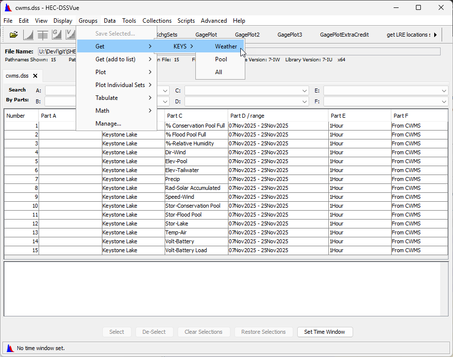
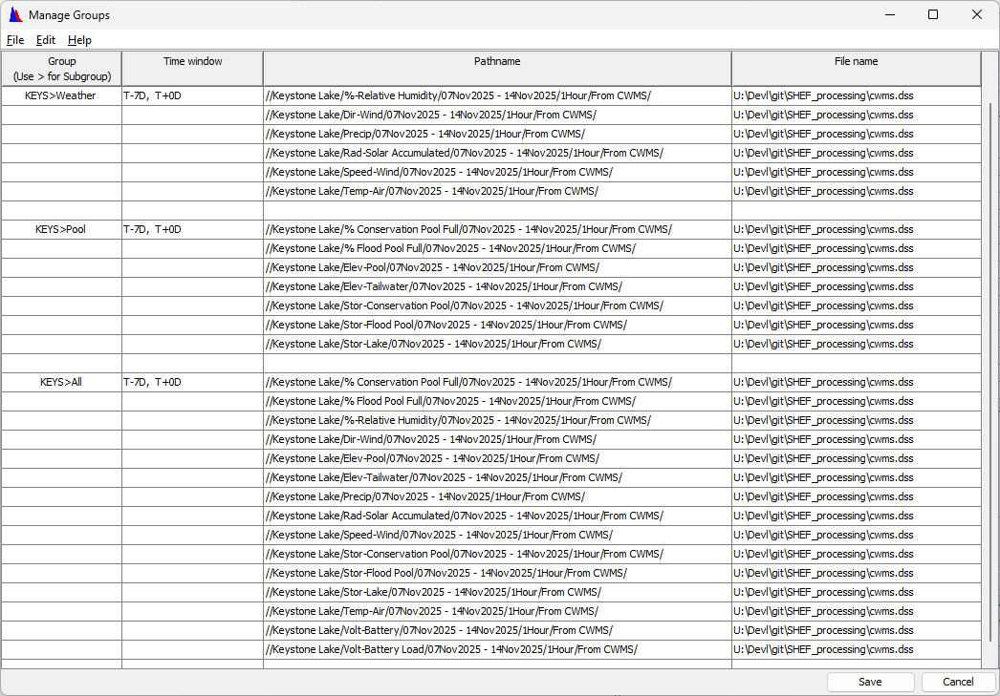

Using the DssExporter Class
===========================

.. toctree::
   :maxdepth: 2
   :caption: Contents:

   dss_sensors+parameters

.. role:: py(code)
    :language: python

Exporting Configuration
-----------------------

The configuration information for unloading SHEF data from an HEC-DSS file is contained in sensor and paramter files as described in
:doc:`dss_sensors+parameters`

Groups
------

Unlike with :py:`CdaLoader`, the unloading configuration for :py:`DssLoader` does not define groups. However, the :py:`DssExporter` can use groups defined
in Hec-DSSVue (see `this page <https://www.hec.usace.army.mil/confluence/dssdocs/dssvueum/overview/groups>`_). These groups are more
sophisticated than simply being a list of time series identifiers (pathnames).

* **Groups are not associated with a specific HEC-DSS file**: HEC-DSSVue defines the location for its groups independent of 
  any HEC-DSS file (``%USERPROFILE%\Application Data\HEC\HEC-DSSVue\groups.txt`` on Windows)
* **Groups may or may not specify a time window**: When exporting a group that defines a time window, that time window is used by
  :py:`DssExporter`. If the group doesn't define a time window, then the exporter's time window is used
* **Each pathname has an associated HEC-DSS file name**: When exporting a group, :py:`DssExporter` retrieves the time series from
  the file indicated in the group

The available properties are:

* :py:`override_group_time_window: bool` (get/set) specifies whether the exporter's time window overrides any time window specified for the
  group in the groups file. The default value is :py:`False`

* :py:`override_group_file_name: bool` (get/set) specifies whether the exporter's HEC-DSS file overrides any file name specified for the
   time series in the groups file. The default value is :py:`False`

The available groups operations are:

* :py:`get_groups() -> dict[str, dict[str, Any]]` returns a dictionary that has the available group names as keys. The values of the dictionary are
  dictionaries with keys of:
  
  * ``"timewindow"`` whose value is the time window string of the group
  * ``"datasets"`` whose value is a list of lists of strings containing ``[<dss-file-name>, <pathname>]``
* :py:`get_time_series(group: str) -> list[list[str]]` returns the list of datasets for the group. Each dataset is a list of strings containing
  ``[<dss-file-name>, <pathname>]``
* :py:`get_time_window_str(group: str) -> Optional[str]` returns the time window string for the group, if any
  If the group does not define a time window, the returned value will be ``None``
* :py:`get_time_window(group: str) -> Optional[list[datetime]]` returns the time window, if any, as a list of ``datetime`` objects containing
  ``[<start_time>, <end_time>]``. If the group does not define a time window, the returned value will be ``None``. In order to parse the time window
  string into ``datetime`` objects, the hec-python-library package must be installed (``pip install hec-python-library``)

Example
-------

The below example demonstrates using the :py:`DssExporter` to export a group defined in HEC-DSSVue

   HEC-DSSVue showning the Groups menu (double-click to see larger image).

   HEC-DSSVue Manage Groups dialog (double-click to see larger image).

Note that unlike the :py:`CdaLoader`, the :py:`DssLoader` annotates the generated SHEF text. In this script we use :py:`get_export(indentifier: str)`
to remove the annotations before writing the ``Keystone.shef``

.. code-block:: python

   # export_keystone.py

   import os
   from shef.exporters import DssExporter

   exporter = DssExporter("cwms.dss", "cwms_sensors.csv", "cwms_parameters.csv")
   groups = exporter.get_groups()
   for group in groups:
      print(group)
      print(f"\t{exporter.get_time_window_str(group)}")
      print(f"\t{exporter.get_time_window(group)}")
      print(f"\t{len(exporter.get_time_series(group))} datasets")

   group = "KEYS>Weather"
   assert group in groups

   # ------------------------------------------------------------- #
   # Create an annotated SHEF file Source pathnames and SHEF units #
   # ------------------------------------------------------------- #
   with open("Keystone-annotated.shef", "w") as f:
      exporter.set_output(f)
      exporter.export(group)
   # --------------------------------------------------- #
   # Create a bare SHEF file by removing the annotations #
   # --------------------------------------------------- #
   with open("Keystone.shef", "w") as f:
      exporter.set_output(f)
      data = exporter.get_export(group)
      for line in data.split("\n"):
         if line.startswith(":"):
            continue
         count = f.write(f"{line}\n")

::

   U:\Devl\git\SHEF_processing>python export_keystone.py

   KEYS>Weather
         T-7D,  T+0D
         [datetime.datetime(2025, 11, 18, 17, 2), datetime.datetime(2025, 11, 25, 17, 2)]
         6 datasets
   KEYS>Pool
         T-7D,  T+0D
         [datetime.datetime(2025, 11, 18, 17, 2), datetime.datetime(2025, 11, 25, 17, 2)]
         7 datasets
   KEYS>All
         T-7D,  T+0D
         [datetime.datetime(2025, 11, 18, 17, 2), datetime.datetime(2025, 11, 25, 17, 2)]
         15 datasets

   U:\Devl\git\SHEF_processing>

.. dropdown:: Keystone-annotated.shef

   ::

      :--------------------------------------------------------------------------------
      : Pathname = //Keystone Lake/%-Relative Humidity/07Nov2025 - 14Nov2025/1Hour/From CWMS/
      : Unit = %
      .E KEYO2 20251118 Z DH1700/XR/DIH01/56.53/55.26/53.87/50.73/42.98/43.33/38.82/44.36/55.14/74.38/80.86/82.96/85.58/79.7/70.86/70.17
      .E00 71.85/78.04/76.61/82.31/82.35/78.17/75.53/69.09/64.75/65.4/56.23/46.52/45.19/46.82/49.04/55.28/60.45/64.37/67.5/80.08/95.56
      .E01 93.3/93.26/96.86/96.86/94.51/99.9/97.86/100.24/100.05/99.35/99.92/99.96/98.8/100.26/100.26/100.26/100.25/100.25/100.25/100.25
      .E02 100.26/100.08/100.27/98.84/99.64/100.1/100.2/99.9/97.6/97.02/94.64/96.2/98.16/93.53/86.02/79.44/69.91/63.66/56.85/56.87/61.52
      .E03 71.78/78.5/81.21/78.31/75.38/74.2/76.02/80.45/84.08/86.77/88.33/88.23/88.43/90.51/90.58/91.06/92.36/93.26/92.8/92.82/91.33
      .E04 90.14/88.09/86.85/86.85/87.01/87.98/88.56/89.55/91.15/92.18/92.72/93.87/94.62/95.94/98.21/99.69/100.23/100.23/100.23/100.23
      .E05 100.2/99.36/95.92/95.14/94.92/92.31/88.79/90.4/91.52/92.43/92.37/94.71/100.23/100.22/100.22/100.22/100.22/100.22/100.23/100.24
      .E06 100.24/100.24/100.24/100.1/99.74/100.23/100.23/100.23/100.25/100.24/100.23/100.23/100.24/100.24/100.25/100.25/100.24/100.24
      .E07 100.24/100.25/100.17/100.24/100.25/100.23/99.15/98.16/96.69/97.71

      :--------------------------------------------------------------------------------
      : Pathname = //Keystone Lake/Dir-Wind/07Nov2025 - 14Nov2025/1Hour/From CWMS/
      : Unit = deg
      .E KEYO2 20251118 Z DH1700/UD/DIH01/284.1/282.1/298.9/289.1/281.1/290.6/276.3/296.5/306.2/300.6/286.1/292.4/300.6/299.1/292.8/36.3
      .E00 49.4/108.7/84.3/117.8/108.0/89.0/108.3/87.5/197.1/284.1/305.9/79.7/98.0/101.0/104.9/112.0/111.6/106.3/119.7/113.6/120.3/104.9
      .E01 315.2/105.6/105.0/81.4/112.6/85.0/114.9/109.7/99.9/104.2/104.3/135.7/111.6/125.3/132.6/109.1/105.8/108.2/112.6/115.4/116.9
      .E02 128.7/132.1/133.5/124.9/119.6/133.0/193.0/190.2/220.8/240.0/159.6/150.7/219.3/237.8/252.6/248.3/265.3/281.4/289.4/295.2/294.1
      .E03 296.9/294.1/293.8/292.8/290.6/294.3/297.1/299.6/305.9/311.3/310.4/312.7/313.3/319.2/323.2/302.7/309.9/296.3/302.8/291.2/296.4
      .E04 309.3/308.9/278.8/227.9/217.5/151.2/156.5/148.3/134.7/159.9/106.3/123.2/108.6/102.6/115.8/101.7/108.6/119.4/127.5/136.1/111.3
      .E05 128.9/107.8/123.0/114.7/106.2/113.0/109.3/260.9/69.8/95.3/101.6/118.4/91.1/105.7/106.7/108.1/107.8/115.3/113.6/117.5/110.6
      .E06 107.1/113.2/129.0/135.7/139.6/135.9/162.5/230.9/144.4/151.3/200.4/211.5/185.9/239.8/271.7/279.6/299.4/297.3/296.4/296.6/297.5
      .E07 304.8/298.0/295.5

      :--------------------------------------------------------------------------------
      : Pathname = //Keystone Lake/Precip/07Nov2025 - 14Nov2025/1Hour/From CWMS/
      : Unit = in
      .E KEYO2 20251118 Z DH1700/PC/DIH01/3.64/3.64/3.64/3.64/3.64/3.64/3.64/3.64/3.64/3.64/3.64/3.64/3.64/3.64/3.64/3.64/3.64/3.64/3.64
      .E00 3.64/3.64/3.64/3.64/3.64/3.64/3.64/3.64/3.64/3.64/3.64/3.64/3.64/3.64/3.64/3.64/3.67/3.67/3.69/3.71/3.71/3.72/3.72/3.72/3.72
      .E01 3.72/3.72/3.72/3.72/3.72/3.78/3.95/4.07/4.19/4.28/4.28/4.28/4.29/4.29/4.3/4.3/4.3/4.3/4.3/4.3/4.3/4.3/4.3/4.3/4.3/4.3/4.31/4.31
      .E02 4.31/4.31/4.31/4.31/4.31/4.31/4.31/4.31/4.31/4.31/4.31/4.31/4.31/4.31/4.31/4.31/4.31/4.31/4.31/4.31/4.31/4.31/4.31/4.31/4.31
      .E03 4.31/4.31/4.31/4.31/4.31/4.31/4.31/4.31/4.31/4.31/4.31/4.31/4.31/4.31/4.31/4.31/4.31/4.31/4.31/4.31/4.31/4.31/4.31/4.31/4.31
      .E04 4.31/4.31/4.31/4.31/4.31/4.31/4.31/4.31/4.31/4.48/4.57/4.7/4.8/4.8/4.8/4.8/4.8/4.8/4.8/4.8/4.81/4.81/4.81/4.81/4.81/4.81/4.81
      .E05 4.85/4.92/4.93/4.93/4.93/4.93/4.93/4.93/4.93/4.93/4.93/4.93/4.93/4.93/4.93/4.94/4.94/4.94

      :--------------------------------------------------------------------------------
      : Pathname = //Keystone Lake/Rad-Solar Accumulated/07Nov2025 - 14Nov2025/1Hour/From CWMS/
      : Unit = langley
      .E KEYO2 20251118 Z DH1700/RI/DIH01/361.1/513.6/333.3/56.0/267.1/155.3/41.8/0.0/0.0/0.0/0.0/0.0/0.0/0.0/0.0/0.0/0.0/0.0/0.0/0.0/0.0
      .E00 14.3/153.9/276.7/416.8/393.6/287.2/172.5/162.5/75.4/23.4/0.0/0.0/0.0/0.0/0.0/0.0/0.0/0.0/0.0/0.0/0.0/0.0/0.0/0.0/0.5/21.1/46.5
      .E01 23.3/0.0/0.0/0.4/9.6/2.4/0.0/0.0/0.0/0.0/0.0/0.0/0.0/0.0/0.0/0.0/0.0/0.0/0.0/0.0/0.0/64.7/268.2/430.0/527.3/602.8/359.8/56.2
      .E02 254.8/165.1/51.1/0.0/0.0/0.0/0.0/0.0/0.0/0.0/0.0/0.0/0.0/0.0/0.0/0.0/0.0/0.0/7.4/32.6/43.1/56.3/73.6/59.1/59.4/25.9/0.0/0.0/0.0
      .E03 0.0/0.0/0.0/0.0/0.0/0.0/0.0/0.0/0.0/0.0/0.0/0.0/0.0/13.9/43.4/74.9/126.0/118.1/95.3/83.3/86.7/1.5/0.0/0.0/0.0/0.0/0.0/0.0/0.0
      .E04 0.0/0.0/0.0/0.0/0.0/0.0/0.0/0.0/0.0/0.0/6.4/30.1/43.8/29.8/9.0/6.7/0.0/0.0/0.0/0.0/0.0/0.0/0.0/0.0/0.0/0.0/0.0/0.0/0.0/0.0/0.0
      .E05 0.8/20.3

      :--------------------------------------------------------------------------------
      : Pathname = //Keystone Lake/Speed-Wind/07Nov2025 - 14Nov2025/1Hour/From CWMS/
      : Unit = mph
      .E KEYO2 20251118 Z DH1700/US/DIH01/11.6/10.4/5.7/3.1/1.9/3.5/4.8/2.6/3.5/2.7/2.9/3.6/1.7/3.0/1.3/1.8/1.0/0.9/1.9/1.5/0.4/1.5/1.5
      .E00 2.9/1.7/3.2/2.8/4.8/6.8/6.6/4.2/3.8/2.3/0.5/3.0/5.2/3.6/6.0/2.6/4.9/4.5/4.8/3.8/2.9/2.5/3.9/3.4/4.2/6.4/7.8/3.8/5.9/5.5/3.9/7.0
      .E01 5.7/9.4/10.8/9.8/8.2/8.6/7.2/7.8/7.9/8.0/5.4/5.6/6.1/3.7/1.2/2.5/5.1/7.9/9.5/8.9/14.1/14.2/13.3/14.3/16.0/14.6/14.8/16.1/15.4
      .E02 12.5/12.3/13.9/13.8/13.5/14.8/14.0/13.8/16.0/12.7/11.4/10.7/10.5/8.6/7.1/6.6/4.9/4.2/5.0/3.9/3.3/2.4/2.2/2.2/2.1/2.4/2.2/3.2
      .E03 3.2/2.6/2.9/3.1/5.0/5.6/5.7/4.3/4.4/5.0/6.3/5.6/5.6/5.8/6.3/9.3/7.1/7.1/3.1/4.5/5.2/4.1/6.1/8.6/7.0/7.6/7.8/8.7/8.7/10.8/7.6
      .E04 4.7/4.2/3.7/4.4/5.6/4.4/1.6/2.5/4.4/3.4/1.8/1.8/1.4/2.8/3.0/6.3/8.1/9.4/7.2/8.7/11.4/10.7/8.2/10.0

      :--------------------------------------------------------------------------------
      : Pathname = //Keystone Lake/Temp-Air/07Nov2025 - 14Nov2025/1Hour/From CWMS/
      : Unit = F
      .E KEYO2 20251118 Z DH1700/TA/DIH01/63.392/64.292/66.056/68.918/73.436/74.156/74.336/70.628/66.812/62.708/60.206/59.414/58.352
      .E00 58.532/58.208/57.146/56.12/54.23/53.69/51.944/51.458/51.332/53.114/56.12/59.882/60.512/64.724/70.25/71.456/70.988/70.502/67.928
      .E01 65.66/64.4/63.068/61.016/60.134/60.206/63.698/63.5/63.986/65.39/63.608/64.634/63.464/63.086/63.284/63.842/64.742/65.75/64.598
      .E02 64.346/63.95/63.59/62.87/62.924/63.428/64.58/64.724/63.986/63.662/63.248/62.942/62.258/62.762/63.266/63.302/63.104/61.466/60.17
      .E03 61.88/63.752/64.724/66.164/67.946/68.81/68.702/67.406/64.508/60.584/57.02/56.714/56.318/55.724/54.842/53.726/53.42/53.312/53.06
      .E04 52.556/51.8/50.558/49.37/48.47/48.128/48.218/48.02/48.128/48.254/48.776/49.352/49.604/49.712/49.928/49.586/49.442/48.902/48.578
      .E05 48.434/48.182/47.912/47.786/47.606/47.174/47.084/46.724/46.652/46.688/47.138/47.444/47.93/48.794/49.55/49.946/50.864/52.106
      .E06 51.962/52.052/51.98/53.114/52.844/51.674/50.954/51.098/51.116/51.656/52.124/52.682/53.204/53.384/53.51/53.798/54.59/55.04
      .E07 54.986/55.562/56.174/56.984/57.074/57.326/57.65/57.884/57.866/58.118/58.19/57.92/57.812/57.488/57.488/57.326/56.192/55.796
      .E08 55.67/54.986/54.14/54.698/54.086

.. dropdown:: Keystone.shef

   ::

      .E KEYO2 20251118 Z DH1700/XR/DIH01/56.53/55.26/53.87/50.73/42.98/43.33/38.82/44.36/55.14/74.38/80.86/82.96/85.58/79.7/70.86/70.17
      .E00 71.85/78.04/76.61/82.31/82.35/78.17/75.53/69.09/64.75/65.4/56.23/46.52/45.19/46.82/49.04/55.28/60.45/64.37/67.5/80.08/95.56
      .E01 93.3/93.26/96.86/96.86/94.51/99.9/97.86/100.24/100.05/99.35/99.92/99.96/98.8/100.26/100.26/100.26/100.25/100.25/100.25/100.25
      .E02 100.26/100.08/100.27/98.84/99.64/100.1/100.2/99.9/97.6/97.02/94.64/96.2/98.16/93.53/86.02/79.44/69.91/63.66/56.85/56.87/61.52
      .E03 71.78/78.5/81.21/78.31/75.38/74.2/76.02/80.45/84.08/86.77/88.33/88.23/88.43/90.51/90.58/91.06/92.36/93.26/92.8/92.82/91.33
      .E04 90.14/88.09/86.85/86.85/87.01/87.98/88.56/89.55/91.15/92.18/92.72/93.87/94.62/95.94/98.21/99.69/100.23/100.23/100.23/100.23
      .E05 100.2/99.36/95.92/95.14/94.92/92.31/88.79/90.4/91.52/92.43/92.37/94.71/100.23/100.22/100.22/100.22/100.22/100.22/100.23/100.24
      .E06 100.24/100.24/100.24/100.1/99.74/100.23/100.23/100.23/100.25/100.24/100.23/100.23/100.24/100.24/100.25/100.25/100.24/100.24
      .E07 100.24/100.25/100.17/100.24/100.25/100.23/99.15/98.16/96.69/97.71

      .E KEYO2 20251118 Z DH1700/UD/DIH01/284.1/282.1/298.9/289.1/281.1/290.6/276.3/296.5/306.2/300.6/286.1/292.4/300.6/299.1/292.8/36.3
      .E00 49.4/108.7/84.3/117.8/108.0/89.0/108.3/87.5/197.1/284.1/305.9/79.7/98.0/101.0/104.9/112.0/111.6/106.3/119.7/113.6/120.3/104.9
      .E01 315.2/105.6/105.0/81.4/112.6/85.0/114.9/109.7/99.9/104.2/104.3/135.7/111.6/125.3/132.6/109.1/105.8/108.2/112.6/115.4/116.9
      .E02 128.7/132.1/133.5/124.9/119.6/133.0/193.0/190.2/220.8/240.0/159.6/150.7/219.3/237.8/252.6/248.3/265.3/281.4/289.4/295.2/294.1
      .E03 296.9/294.1/293.8/292.8/290.6/294.3/297.1/299.6/305.9/311.3/310.4/312.7/313.3/319.2/323.2/302.7/309.9/296.3/302.8/291.2/296.4
      .E04 309.3/308.9/278.8/227.9/217.5/151.2/156.5/148.3/134.7/159.9/106.3/123.2/108.6/102.6/115.8/101.7/108.6/119.4/127.5/136.1/111.3
      .E05 128.9/107.8/123.0/114.7/106.2/113.0/109.3/260.9/69.8/95.3/101.6/118.4/91.1/105.7/106.7/108.1/107.8/115.3/113.6/117.5/110.6
      .E06 107.1/113.2/129.0/135.7/139.6/135.9/162.5/230.9/144.4/151.3/200.4/211.5/185.9/239.8/271.7/279.6/299.4/297.3/296.4/296.6/297.5
      .E07 304.8/298.0/295.5

      .E KEYO2 20251118 Z DH1700/PC/DIH01/3.64/3.64/3.64/3.64/3.64/3.64/3.64/3.64/3.64/3.64/3.64/3.64/3.64/3.64/3.64/3.64/3.64/3.64/3.64
      .E00 3.64/3.64/3.64/3.64/3.64/3.64/3.64/3.64/3.64/3.64/3.64/3.64/3.64/3.64/3.64/3.64/3.67/3.67/3.69/3.71/3.71/3.72/3.72/3.72/3.72
      .E01 3.72/3.72/3.72/3.72/3.72/3.78/3.95/4.07/4.19/4.28/4.28/4.28/4.29/4.29/4.3/4.3/4.3/4.3/4.3/4.3/4.3/4.3/4.3/4.3/4.3/4.3/4.31/4.31
      .E02 4.31/4.31/4.31/4.31/4.31/4.31/4.31/4.31/4.31/4.31/4.31/4.31/4.31/4.31/4.31/4.31/4.31/4.31/4.31/4.31/4.31/4.31/4.31/4.31/4.31
      .E03 4.31/4.31/4.31/4.31/4.31/4.31/4.31/4.31/4.31/4.31/4.31/4.31/4.31/4.31/4.31/4.31/4.31/4.31/4.31/4.31/4.31/4.31/4.31/4.31/4.31
      .E04 4.31/4.31/4.31/4.31/4.31/4.31/4.31/4.31/4.31/4.48/4.57/4.7/4.8/4.8/4.8/4.8/4.8/4.8/4.8/4.8/4.81/4.81/4.81/4.81/4.81/4.81/4.81
      .E05 4.85/4.92/4.93/4.93/4.93/4.93/4.93/4.93/4.93/4.93/4.93/4.93/4.93/4.93/4.93/4.94/4.94/4.94

      .E KEYO2 20251118 Z DH1700/RI/DIH01/361.1/513.6/333.3/56.0/267.1/155.3/41.8/0.0/0.0/0.0/0.0/0.0/0.0/0.0/0.0/0.0/0.0/0.0/0.0/0.0/0.0
      .E00 14.3/153.9/276.7/416.8/393.6/287.2/172.5/162.5/75.4/23.4/0.0/0.0/0.0/0.0/0.0/0.0/0.0/0.0/0.0/0.0/0.0/0.0/0.0/0.0/0.5/21.1/46.5
      .E01 23.3/0.0/0.0/0.4/9.6/2.4/0.0/0.0/0.0/0.0/0.0/0.0/0.0/0.0/0.0/0.0/0.0/0.0/0.0/0.0/0.0/64.7/268.2/430.0/527.3/602.8/359.8/56.2
      .E02 254.8/165.1/51.1/0.0/0.0/0.0/0.0/0.0/0.0/0.0/0.0/0.0/0.0/0.0/0.0/0.0/0.0/0.0/7.4/32.6/43.1/56.3/73.6/59.1/59.4/25.9/0.0/0.0/0.0
      .E03 0.0/0.0/0.0/0.0/0.0/0.0/0.0/0.0/0.0/0.0/0.0/0.0/0.0/13.9/43.4/74.9/126.0/118.1/95.3/83.3/86.7/1.5/0.0/0.0/0.0/0.0/0.0/0.0/0.0
      .E04 0.0/0.0/0.0/0.0/0.0/0.0/0.0/0.0/0.0/0.0/6.4/30.1/43.8/29.8/9.0/6.7/0.0/0.0/0.0/0.0/0.0/0.0/0.0/0.0/0.0/0.0/0.0/0.0/0.0/0.0/0.0
      .E05 0.8/20.3

      .E KEYO2 20251118 Z DH1700/US/DIH01/11.6/10.4/5.7/3.1/1.9/3.5/4.8/2.6/3.5/2.7/2.9/3.6/1.7/3.0/1.3/1.8/1.0/0.9/1.9/1.5/0.4/1.5/1.5
      .E00 2.9/1.7/3.2/2.8/4.8/6.8/6.6/4.2/3.8/2.3/0.5/3.0/5.2/3.6/6.0/2.6/4.9/4.5/4.8/3.8/2.9/2.5/3.9/3.4/4.2/6.4/7.8/3.8/5.9/5.5/3.9/7.0
      .E01 5.7/9.4/10.8/9.8/8.2/8.6/7.2/7.8/7.9/8.0/5.4/5.6/6.1/3.7/1.2/2.5/5.1/7.9/9.5/8.9/14.1/14.2/13.3/14.3/16.0/14.6/14.8/16.1/15.4
      .E02 12.5/12.3/13.9/13.8/13.5/14.8/14.0/13.8/16.0/12.7/11.4/10.7/10.5/8.6/7.1/6.6/4.9/4.2/5.0/3.9/3.3/2.4/2.2/2.2/2.1/2.4/2.2/3.2
      .E03 3.2/2.6/2.9/3.1/5.0/5.6/5.7/4.3/4.4/5.0/6.3/5.6/5.6/5.8/6.3/9.3/7.1/7.1/3.1/4.5/5.2/4.1/6.1/8.6/7.0/7.6/7.8/8.7/8.7/10.8/7.6
      .E04 4.7/4.2/3.7/4.4/5.6/4.4/1.6/2.5/4.4/3.4/1.8/1.8/1.4/2.8/3.0/6.3/8.1/9.4/7.2/8.7/11.4/10.7/8.2/10.0

      .E KEYO2 20251118 Z DH1700/TA/DIH01/63.392/64.292/66.056/68.918/73.436/74.156/74.336/70.628/66.812/62.708/60.206/59.414/58.352
      .E00 58.532/58.208/57.146/56.12/54.23/53.69/51.944/51.458/51.332/53.114/56.12/59.882/60.512/64.724/70.25/71.456/70.988/70.502/67.928
      .E01 65.66/64.4/63.068/61.016/60.134/60.206/63.698/63.5/63.986/65.39/63.608/64.634/63.464/63.086/63.284/63.842/64.742/65.75/64.598
      .E02 64.346/63.95/63.59/62.87/62.924/63.428/64.58/64.724/63.986/63.662/63.248/62.942/62.258/62.762/63.266/63.302/63.104/61.466/60.17
      .E03 61.88/63.752/64.724/66.164/67.946/68.81/68.702/67.406/64.508/60.584/57.02/56.714/56.318/55.724/54.842/53.726/53.42/53.312/53.06
      .E04 52.556/51.8/50.558/49.37/48.47/48.128/48.218/48.02/48.128/48.254/48.776/49.352/49.604/49.712/49.928/49.586/49.442/48.902/48.578
      .E05 48.434/48.182/47.912/47.786/47.606/47.174/47.084/46.724/46.652/46.688/47.138/47.444/47.93/48.794/49.55/49.946/50.864/52.106
      .E06 51.962/52.052/51.98/53.114/52.844/51.674/50.954/51.098/51.116/51.656/52.124/52.682/53.204/53.384/53.51/53.798/54.59/55.04
      .E07 54.986/55.562/56.174/56.984/57.074/57.326/57.65/57.884/57.866/58.118/58.19/57.92/57.812/57.488/57.488/57.326/56.192/55.796
      .E08 55.67/54.986/54.14/54.698/54.086

